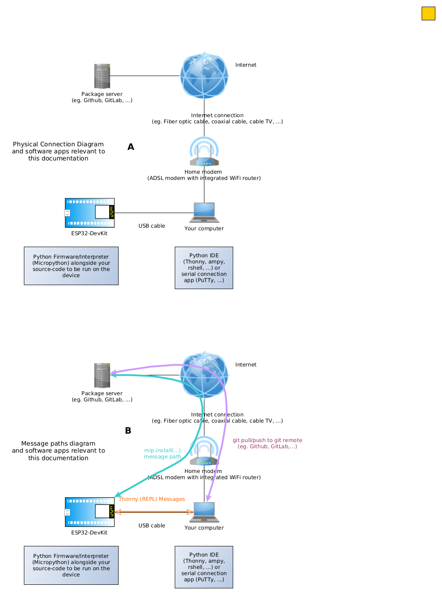

# Package Template

Package Template

(meta) Considerations

1. I believe running through a simple tutorial or a simple example is the most natural way to learn something.
   - but *simple* examples may get complicated as the author knowledge evolves. I'll try not to do this.
2. This example is based on https://github.com/jimmo/micropython-mlx90640 (forked on Sept, 15, 2024)
   - added a working function into `packageTemplate.utils` in order to provide a more useful example
3. There are, at least, two development processes to reference to. A) Install a package for use in some app; B) Develop/Deploy a package (for Micropython). This instruction deals with B).

## Objective

Show how to create Micropython packages with explanations (as detailed as possible/manageable)

## Results

### The shortest path (by now)

1. Install, to your micropython device, this package (to test if the instructions are still useful);
2. Run, in you micropython device, a function from the package;
3. Clone/Fork this repository (do not change the repository name);
4. Edit file `utils.py` add your code in it;
5. Commit changes
6. Install, to your micropython device, your package;

#### Install, to your micropython device, this package (to test if the instructions are still useful);

Connect you micropython device to the Internet by ajusting and running the code below:
  
```python
import network, time
staif=network.WLAN(network.STA_IF) 
staif.active(True) 
staif.connect(<YOUR_NET>, <PASSWORDOFYOUR_NET>)
```

Download and install the package by running the code below:
  
```python
import mip
mip.install("github:FNakano/micropython-packageTemplate")
```

Expected result:


#### Run, in you micropython device, a function from the package;

 Package name is `packageTemplate`. It contains a module named `utils`. This module contains a function named `sayHello(name)`
 
Run the function by running the code below:

```python
import packageTemplate
from packageTemplate import utils
utils.sayHello('Jim') 
```

Expected result:
  


#### Clone/Fork this repository (do not change the repository name) to your github user or to your local computer;
#### Edit file `utils.py` add your code into it;
#### Commit changes to your repository in Github;
#### Install, to your micropython device, your package;

```python
import mip
mip.install("github:YOUR_GITHUB_USER/micropython-packageTemplate")
```
## Development Setup

Hardware/Software setup reference to this instruction is: An ESP32S Dev Kit, connected through USB cable to your computer, both can access the Internet (probably through a combo ADSL modem + WiFi Router). A package repository (Github or GitLab) must be reacheable from ESP32S Dev Kit and your computer. (Figure 1-A)

In my computer I use Thonny to get a REPL shell to communicate (issue commands, upload/download files) to Micropython installed on ESP32S Dev Kit. Micropython version I use is v1.23.0 (2024-06-02) .bin (https://micropython.org/resources/firmware/ESP32_GENERIC-20240602-v1.23.0.bin). Less relevant informatino: Thonny version is 3.3.14. OS is Ubuntu 22.04LTS . Local Python version is 3.10.12

On the communication between agents and the workflow: I send commands to ESP32S Dev Kit using Thonny. These commands *flow* through the USB Cable.Command `mip.install(<some site>)` executed on ESP32S Dev Kit with Micropython searches for <some site>. To achieve this, a connection from ESP32S Dev Kit and the Internet must be active (That's why we connect ESP32S Dev Kit to the internet first). On the package developer view, the package is deployed to <some site>.

Before deploying the package, it should be developed. Package developing can be performed on the git remote (Github has tools to edit source-code stored on repositories in the site). Other (more common) way is to clone the git repository in your computer, develop the package locally and (git) push it to the repository (Github).
  
Figure 1:




## Details

According to *Installing packages with mip* (https://docs.micropython.org/en/latest/reference/packages.html), mip can install a single file, given its URL as argument, for instance: `mip.install("http://example.com/x/y/foo.py")`.

There are shortcuts to Github and Gitlab, for instance: `mip.install("github:org/repo/path/foo.py")`

Packages can be installed from a specified Git branch: `mip.install("github:org/repo/path/foo.py", version="branch-or-tag")`

If a package consists of more than one file, the argument should point to a `package.json` file that contains all files sources and destinations. If a filename is not in the argument, `mip.install` searches for (appends the string) `package.json` on the URL.(That's why I told you not to change the repository name when forking this repo)

> More sophisticated packages (i.e. with more than one file, or with dependencies) can be downloaded by specifying the path to their package.json.

(Source: https://docs.micropython.org/en/latest/reference/packages.html#installing-packages-with-mip , accessed Sept, 15, 2024)

There is not much documentation on what each entry in `package.json` mean. Perhaps a *by example* approach would be enough. 

```json
{
  "urls": [
    ["packageTemplate/__init__.py", "github:fnakano/micropython-packageTemplate/packageTemplate/__init__.py"],
    ["packageTemplate/utils.py", "github:fnakano/micropython-packageTemplate/packageTemplate/utils.py"]
  ],
  "deps": [
    ["collections-defaultdict", "latest"]
  ],
  "version": "0.1"
}
```

JSON encoding is standardized (https://www.json.org/json-en.html , https://datatracker.ietf.org/doc/html/rfc7159). https://www.json.org/json-en.html contains diagrams depicting JSON syntax. For short:

  > JSON is built on two structures:
  >A collection of name/value pairs. In various languages, this is realized as an object, record, struct, dictionary, hash table, keyed list, or associative array.
  > An ordered list of values. In most languages, this is realized as an array, vector, list, or sequence.
(Source: https://www.json.org/json-en.html)

`package.json` file contains one JSON object consisting in three name:value pairs. Namely "urls":<values>, "deps":<values>, "version":<string-encoded_number>

<values> for "urls" and "deps" are lists of pairs (lists).

In "urls", each pair is [name , value] where name is the destination path (on Micropython device) of some code. value is the source link of some code. Notice that destination path is a relative path. There is a discussion in Micropython forum about the convenience of relative versus absolute paths (https://github.com/orgs/micropython/discussions/11980) (That's why a python package file is installed to /lib in ESP32S Dev Kit Micropython).

In "deps", each pair is [name, value] where name is a dependency name and value is a version specifier. (I didn't explore this, so I don't know where the name is defined (in the dependable package or in the `sys.path`), which syntax is used in a version specifier and which effect it has on the path specifier).

## References

- About Python modules/packages (https://docs.python.org/3/tutorial/modules.html)
  - Explains why `__init.py__` is necessary
  - Explains why
  ```python
  import packageTemplate
  from packageTemplate import utils
  utils.sayHello('Jim') 
  ```
  should be like it is
- latest documentation about Micropython mip: https://docs.micropython.org/en/latest/reference/packages.html
- forum posts on Micropython mip: https://github.com/orgs/micropython/discussions/11980
- repository of packages designed to be useful for writing MicroPython applications: https://github.com/micropython/micropython-lib

